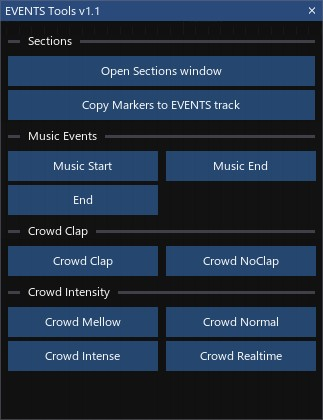
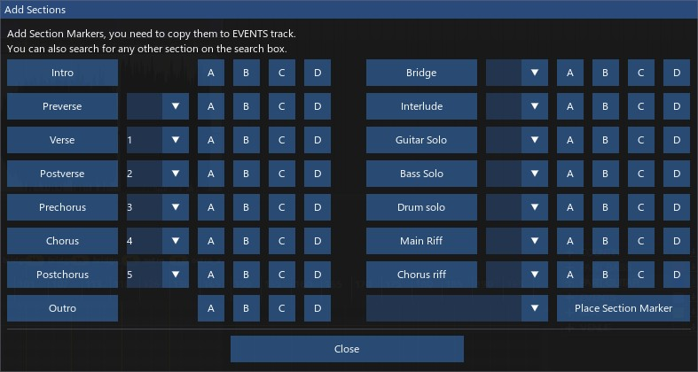
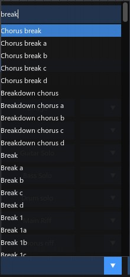

# **EVENTS Tools**  
EVENTS Tools is a ReaScript set for Rock Band 3/YARG authoring workflow. It lets you events like [music_start], [music_end], [end], and crowd clap trigger and intensity events easily. It also includes a way to place RB3-style sections as Reaper project markers and lets you copy them directly into the EVENTS track with proper formatting.
  

  
## Tools  
### Markers and practice sections tools  
Here you can copy your section markers  
  
### Sections 
Here you can add RB3 Sections as project markers. You can also copy all markers as text events on the EVENTS track.
  
### Music events  
Here you can add **[music_start]**, **[music_end]**, and **[end]** events. They're placed at the edit cursor's position.    

### Crowd Clap  
Here you can activate or deactivating the crowd's claps. They work exactly as the Music events tools.  
  
### Crowd intensity  
Here you can change the intensity of the crowd between **mellow**, **normal**, **intense**, or **realtime** (not bpm based).

## Add Section Markers
This window lets you add any RB3 section markers as project markers 
  

You can also search for any other RB3 section on the search box and place it with the button on its side

## **Requirements** 
This ReaScript set is included in MiloHax's [REAPER Charting Setup](https://guides.milohax.org/en/charting/reaper/intro/) guide, so if you downloaded everything from there, you don't need to install anything.

Otherwise, the only thing you'll need to have installed is **ReaImGui**. You can install it via [ReaPack](https://reapack.com/).  

